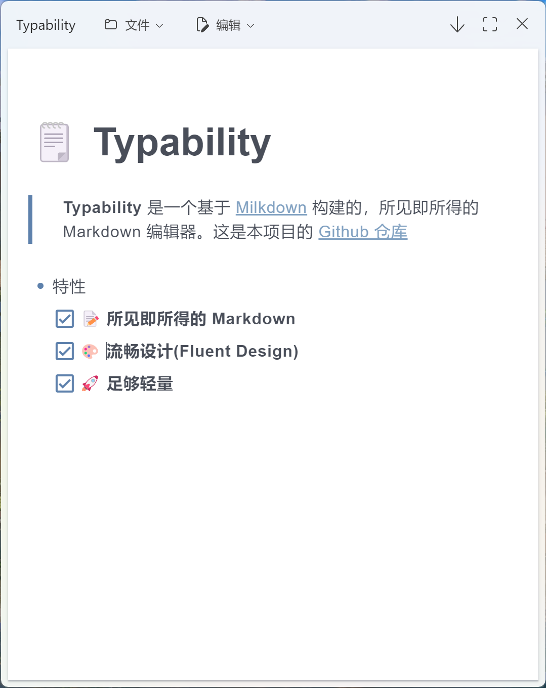

<div align="center">


# Typability
一个基于 [Milkdown](https://milkdown.dev/) 的所见即所得 Markdown 编辑器。
(感谢 [SoilZhu](https://github.com/SoilZhu) 绘制了这个图标!)

[](https://github.com/SimonShiki/Typability/actions/workflows/validate.yml)



</div>

# ✨ 特性
- [x] **🌈 使用流畅设计 (Fluent Design) - 基于微软的 Fluent UI 组件库和使用原生的云母/亚克力窗口**
- [x] **🪶 足够轻量化 - 使用 tauri 进行构建来获得更小的体积和内存占用**
- [x] 📝 **所见即所得的 Markdown - 提供类似于 Typora 的无缝编辑体验**
# 🚧 开发目标
- [x] 多语言支持
- [x] 查找/替换
- [x] LaTeX 支持
- [ ] 更多导出选项
- [ ] 双栏编辑器

# ☔ 系统要求
- [x] Windows 7+ (推荐: Windows 10 1803 +)
- [x] macOS 11.3+ (原因: [Fluent UI's broswer support matrix](https://react.fluentui.dev/?path=/docs/concepts-developer-browser-support-matrix--page))
- [x] 大多数 Linux 发行版 (推荐/已测试: Ubuntu 18.04 +)

# 📦 如何编译
本项目使用 [tauri](https://tauri.app) 构建, 请先跟随 [这篇教程](https://tauri.app/v1/guides/getting-started/prerequisites/)。
```bash
yarn install # Install dependencies
yarn tauri dev # Start development server
yarn tauri build # Bundle App
```
# 🌍 翻译

Typability 从 0.3.0 版本开始添加了多语言支持([Transifex 项目](https://www.transifex.com/typability/typability))。 如果你有意向翻译本项目, 欢迎联系我!
